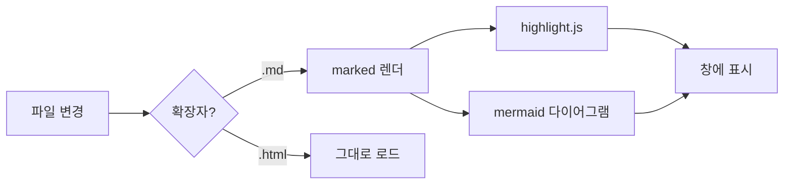
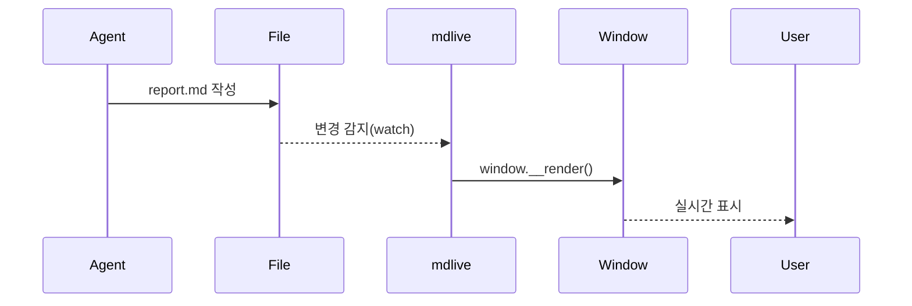

# mdlive 기능 데모

## Mermaid 다이어그램



## 시퀀스 다이어그램



## 코드 하이라이팅

```swift
webView.createPDF(configuration: WKPDFConfiguration()) { result in
    if case .success(let data) = result { try? data.write(to: url) }
}
```

## 단축키

| 기능 | 단축키 |
|------|--------|
| PDF 내보내기 | ⌘E |
| HTML 내보내기 | ⌘⇧E |
| 인쇄 | ⌘P |
| 줌 인/아웃 | ⌘+ / ⌘- |
| 테마 전환 | ⌘T |
