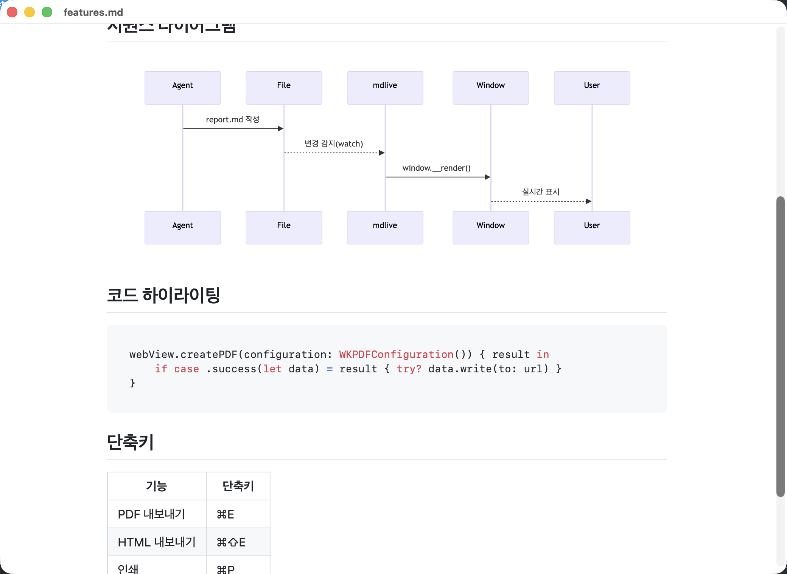
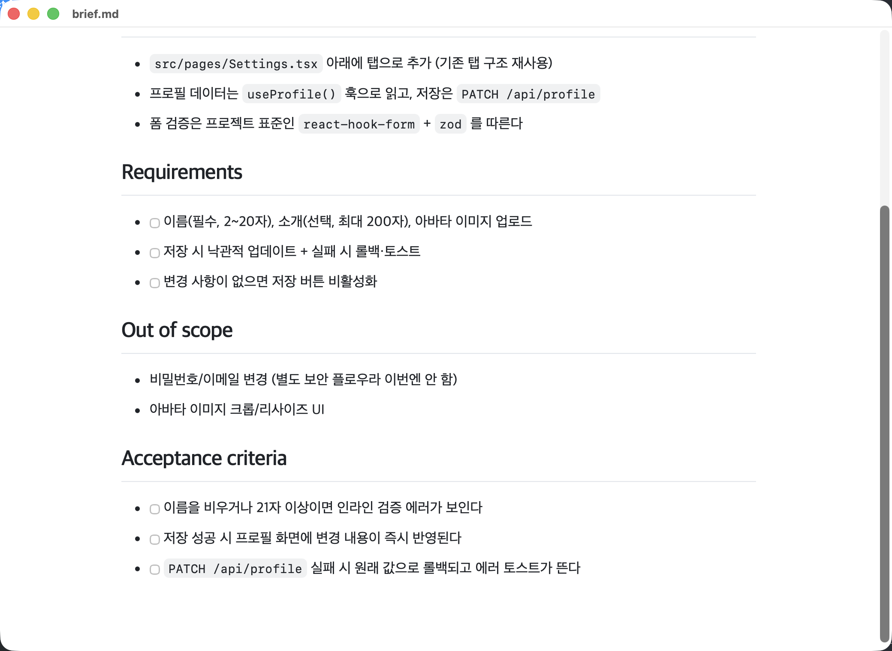

# mdlive

[](https://github.com/maeji/mdlive/actions/workflows/ci.yml)
[](LICENSE)


**English** | [한국어](README.ko.md)

> A lightweight macOS tool that previews the Markdown/HTML your AI agent writes **live, in real time**
> — for Claude Code, Codex, and anything else that writes Markdown to a file.

<p align="center">
  
</p>

When you build docs with an AI agent in the terminal, you end up opening the file in
another app every time you want to *see* the result. mdlive collapses that into one
step — and goes further: it shows the content **filling in live, as the agent writes
it**. Artifacts-like experience, inside your local terminal workflow.

Swift (AppKit + WebKit) handles the window and file watching; the actual rendering is
done by battle-tested JS libraries inside a WKWebView (marked.js · highlight.js ·
github-markdown-css).

## brief-first workflow — one file, hand the whole thing to your agent at once

Starting a new project or adding a feature to an existing one? Skip the heavy setup and
put everything into **a single `brief.md`**. Keep it open in mdlive, refine it back and
forth with your agent in real time, then ship it with one `goal`.

```
write brief.md  ─▶  refine it live with `mdlive --watch`  ─▶  ship it with `goal`
```

- **`templates/brief.md`** — a 5-section lightweight template (Goal / Context /
  Requirements / Out of scope / Acceptance criteria). One screen, no multi-step ceremony
  like spec-kit or Kiro.
- **`goal` skill** — Claude Code / Codex reads the finished brief end to end and
  implements it in one pass: satisfies every requirement, never touches Out of scope.

<p align="center">
  
</p>

> It aims for the **lightweight middle ground** between heavy spec frameworks and raw
> vibe-coding. In-window section-select-and-send-to-agent refinement and a "ready to
> ship" completeness gate are on the roadmap (see below).

## Features

- 🔴 **Live streaming render** — on file change, only the body is swapped (no full
  reload). Text fills in without flicker; if you're near the bottom it auto-follows
  (with a streaming cursor).
- 📝 **brief-first workflow** — refine one `brief.md` live and ship it with `goal` (above)
- 📄 **Markdown → GitHub-style rendering** (GFM: tables, blockquotes, …)
- 🎨 **Code syntax highlighting** (highlight.js)
- 📊 **Mermaid diagrams** — renders ` ```mermaid ` code blocks as diagrams
- 🧮 **KaTeX math** — `$...$` / `$$...$$` (fonts embedded, fully offline)
- 🌐 **Rendering styles** — `--style github|korean|sepia`. `korean` tunes font, line
  height, and `word-break: keep-all` for Korean readability
- 📤 **Export / print** — PDF · self-contained HTML · print (⌘E / ⌘⇧E / ⌘P)
- 🔍 **Zoom · theme toggle** — ⌘+/⌘-/⌘0, ⌘T (auto / light / dark)
- 🌗 **Automatic dark mode** (`prefers-color-scheme`)
- 🧩 **Automatic agent integration** — Claude Code hook / Codex notify: "write it and it pops up"
- 🔌 **Fully offline** — all rendering JS/CSS bundled in the app. No internet needed
- 🪶 **Zero external dependencies** — pure Swift standard frameworks only

## Requirements

- macOS 13+
- Swift 6 / Xcode 26+
- (No internet connection required — all rendering assets ship inside the app)

## Install & use

```bash
git clone https://github.com/maeji/mdlive.git
cd mdlive
swift build -c release

# preview
.build/release/mdlive Examples/sample.md

# live (real-time updates)
.build/release/mdlive Examples/sample.md --watch
```

Install globally:

```bash
cp .build/release/mdlive /usr/local/bin/
mdlive report.md --watch
```

### Options

| Option | Description |
|--------|-------------|
| `<file>` | `.md` / `.markdown` / `.html` / `.htm` file to preview |
| `-w`, `--watch` | re-render live on file change |
| `-s`, `--style <name>` | rendering style: `github` (default) · `korean` · `sepia` |
| `-V`, `--version` | print version |
| `-h`, `--help` | help |

#### Styles

| Style | Description |
|-------|-------------|
| `github` | GitHub default (English-oriented) |
| `korean` | Korean-optimized — Apple SD Gothic Neo, generous line height, `word-break: keep-all` for word-level wrapping |
| `sepia` | warm paper reading theme (Korean fonts applied; works in both light/dark) |

```bash
mdlive doc.md --style korean --watch    # recommended for Korean documents
```

### Shortcuts

| Shortcut | Action |
|----------|--------|
| `⌘E` / `⌘⇧E` | export as PDF / HTML |
| `⌘P` | print |
| `⌘+` / `⌘-` / `⌘0` | zoom in / out / reset |
| `⌘T` | toggle theme (auto → light → dark) |

## Using it with AI agents

mdlive is agent-agnostic — **no matter who writes the file**, `--watch` picks up the
change. To pop it up automatically without typing a command each time, see `integrations/`:

| Agent | Integration | Guide |
|-------|-------------|-------|
| **Claude Code** | PostToolUse hook (auto on Write/Edit) | [integrations/claude-code](integrations/claude-code/) |
| **Codex CLI** | notify hook / `--watch` | [integrations/codex](integrations/codex/) |
| Anything else | `mdlive <file> --watch` | — |

It also works as Claude Code Skills. Drop the two skills in `skill/` into your skills
directory: mdlive answers "show me a preview", and goal answers "build this brief".

```
~/.claude/skills/mdlive/SKILL.md   # live preview
~/.claude/skills/goal/SKILL.md     # read brief.md end to end and implement it in one pass
```

## Layout

```
mdlive/
├── Package.swift
├── Sources/mdlive/
│   ├── main.swift                # CLI arg parsing / entry point
│   ├── PreviewAppDelegate.swift  # window + menus + export/zoom/theme + file watching
│   ├── FileWatcher.swift         # mtime-polling change detection
│   ├── HTMLTemplate.swift        # render shell + window.__render injection point
│   ├── Style.swift               # rendering styles (github/korean/sepia)
│   ├── Assets.swift              # bundled JS/CSS loader (offline)
│   └── Resources/                # marked · highlight.js · mermaid · KaTeX (embedded fonts) · github-markdown-css
├── templates/brief.md            # single-file template for the brief-first workflow
├── skill/
│   ├── mdlive/SKILL.md           # live preview skill
│   └── goal/SKILL.md             # one-shot brief execution skill
├── integrations/
│   ├── mdlive-open.sh            # shared launcher (avoids duplicate windows)
│   ├── claude-code/              # Claude Code hook
│   └── codex/                    # Codex hook
└── Examples/                     # sample.md, brief.md, features.md, math.md, korean.md
```

## How it works

1. **Shell + injection** — the Markdown body is never inlined into the HTML. An empty
   shell loads first, and on each file change Swift calls `window.__render(src)` (via
   `evaluateJavaScript`) to **swap only the body DOM**. So even mid-stream the page never
   reloads and the scroll position is kept.
2. **Scroll-stick** — on update, if you're near the bottom it sticks you to the bottom
   (follows new content like a chat). If you've scrolled up, your position is preserved.
3. **Robust watch** — polls the file's mtime every 0.4s. It uses mtime polling instead of
   vnode events so it survives editors' atomic saves (rename).
4. **Safe injection** — the body string is encoded as a JS literal with `JSONEncoder`,
   eliminating quote / backslash / newline escaping issues at the source.

## Roadmap

- [x] Offline JS/CSS bundling (no CDN dependency)
- [x] Mermaid diagram rendering
- [x] KaTeX math rendering (base64-embedded fonts, offline)
- [x] PDF / HTML export · print · zoom · theme toggle
- [x] brief-first workflow (single `brief.md` template + `goal` skill)
- [ ] brief completeness gate — "ready to ship" check (flag missing sections / untestable criteria)
- [ ] select a section in the preview → send back to the agent (ping-pong automation)
- [ ] LLM-powered brief analysis (ambiguity / gaps / conflicts critique)
- [ ] menu-bar resident mode / multi-tab

## License

MIT. For the licenses of the bundled third-party rendering assets, see [THIRD_PARTY_LICENSES.md](THIRD_PARTY_LICENSES.md).
